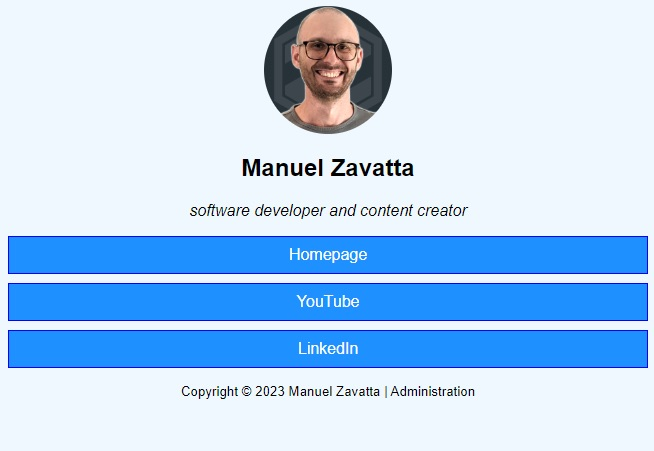

# BioLink (how-to)
> Sviluppato in PHP 8 Procedurale

Questo è il repository dell'how-to sulla creazione di un aggregatore 
di link ispirato a LinkTree tramite PHP Procedurale.

## Links
- Demo: https://corso-php.000webhostapp.com
- Video how-to: https://youtube.com/KG11q3wusBI 
- Playlist corso PHP 8: https://www.youtube.com/playlist?list=PLdYHjrPuGeKECBj1ApufowOXSi_py-6Hb

## Domande?
Se avete delle domande potete lasciare un commento sotto al video sul
canale oppure potete venire a seguire il corso PHP completo sul mio 
canale e commentare sotto uno di quei video!
